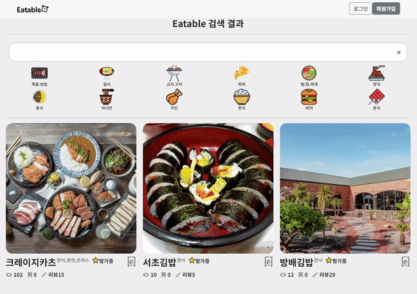
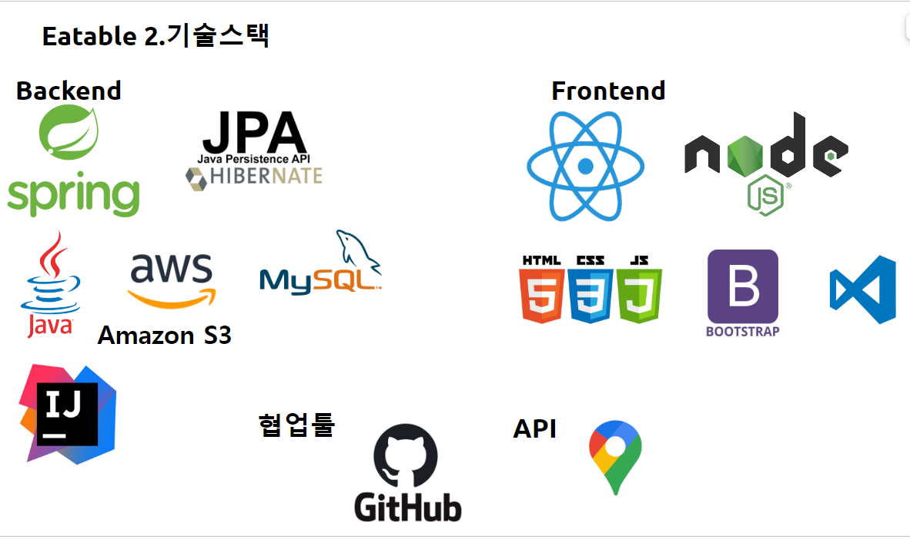
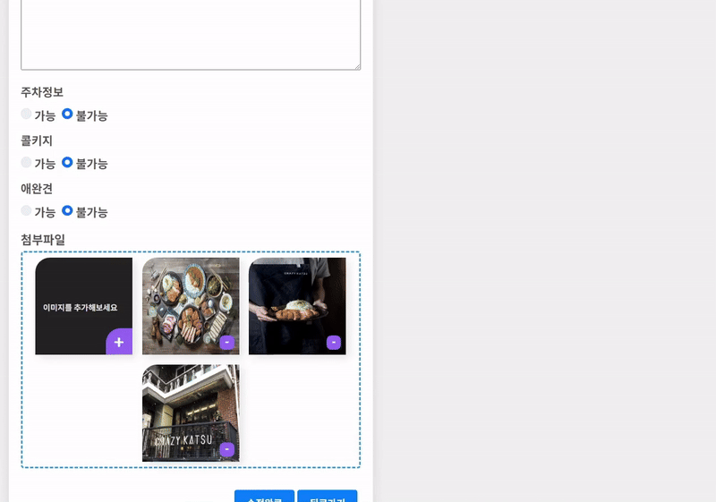
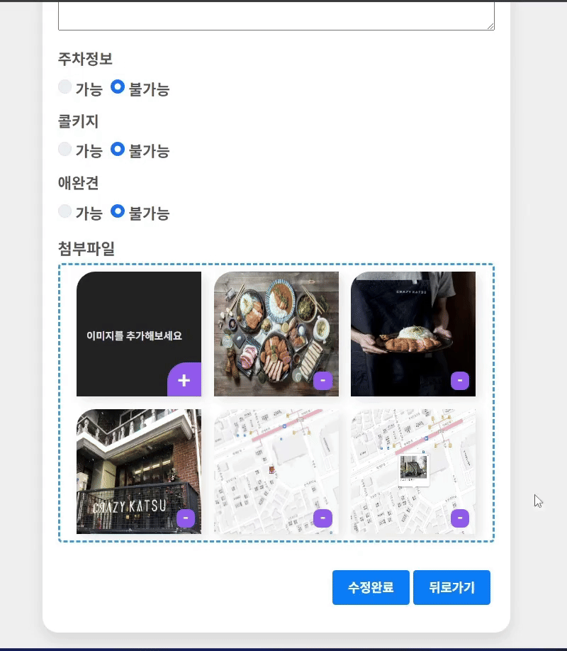
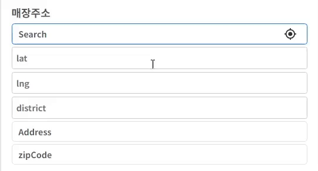
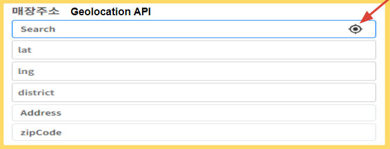
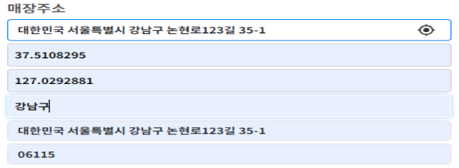

  <h2>카테고리</h2>
  

  <h2>자동검색어(네이버,구글 검색어처럼 구현)</h2>
  

 
  <h2>무한 스크롤</h2>
  

## **Eatable_Frontend 소개**

Eatable은 업체 등록 간소화 쉬운 사용  - 포스기나 별도 절차 설치없이 모바일이나 테블릿 , pc 로 실시간  고객  웨이팅 처리를 할 수 있게 합니다.  또한 간편하고 재미있는 웨이팅 실시간 공유되는 타임라인과 
사용자 온도시스템을 만들어  사용자의 적극적인 정보 공유를 합니다.

## 😀**역활**

|팀원|역할|
|------|---|
|송민호 팀장 | 프로젝트 기획,  스프링부트  JPA , JWT , RestFul API , 음식점 디테일 시각화 (swiper) , AWS s3 이미지파일 외부저장소(path경로 데이터베이스저장) , 리뷰 CRUD , 리뷰타임라인 구현|
|김미란 팀원|온도 콘텐츠 구현|
|임승빈 팀원|어드민 데이터 차트.js 시각화, 상태값 데이터 관리 , 네이버OAuth2로그인 구현|
|조재환 팀원|실시간 웨이팅 및 대기열 구현|
|최진무 팀원|룰렛 , 구글맵API , 업체등록 CRUD , 검색서치 쿼리 구현 (자동검색어,카테고리), 승인된 매장 데이터베이스 저장, 페이지네이션, 무한스크롤, 첨부파일

## 🛠**기술 스텍**

 

 

## 📆**개발 기간**

**2024.01.26 ~ 2024.02.26(총 5주)**

|주차 |구분 |활동|
|:----:|:----:|:----|
|1주차|사전기획   |  프로젝트 주제 선정 및 기획안 작성  | 
|2주차|데이터 수집   |  Google Map / EmailJs / ChartJs / JWT /Websocket|
|3,4주차|기능구현 및 모델링   |  웹 서비스 시스템 설계 및 기능 구현, 기본 스타일 작성  |  
|5주차|서비스 구축   |  기본  CSS 작성,최적화, 오류 수정  |  

## 🔄**시스템 설계**

**Spring Boot 설정**: Spring Data JPA를 사용하여 데이터베이스와 상호 작용.

**Entity 클래스 작성**: MySQL 데이터베이스의 테이블에 대응하는 Java 클래스를 만듦.

**Repository 인터페이스 작성**: 각 엔티티에 대한 Repository 인터페이스를 만들어서 데이터베이스와의 상호 작용을 담당.

**Controller 및 Business Logic**: Spring MVC 패턴을 따르는 컨트롤러를 만들어서 클라이언트의 요청을 처리하고, 비즈니스 로직을 실행

**React 프론트엔드 개발**: React를 사용해서 웹 클라이언트를 만들고 백엔드로부터 데이터를 받아와서 사용자에게 보여줌.

**REST API 구현**: Spring Boot 애플리케이션에서 RESTful 웹 서비스를 구현해서 클라이언트와 통신.

## ❤**이미지 소개**

 
  <h2>DropZone</h2>
  

 
  <h2>Drag and Drop</h2>
  

 
  <h2>구글 자동 검색어(place API - place Autocomplete, Maps Javascript API - Geocode)</h2>
  

 
  <h2>구글 현재 위치</h2>
  
  

 
  <h2>구글맵</h2>
  Google map API - infowindow 대신 modal로 씀
  
  

 
<h2>자체평가 의견 및 느낀점</h2>

이번 프로젝트에서 구글api를 통해 place autocomplete 검색, geocode좌표, 현재위치GPS, 구글지도등에 사용하였습니다. 구글 공식홈페이지에서 해당 기능들을 공부하여 기능들을 구현하였고 구글 api를 사용들을 잘활용할수 있게된 경험이 된것 같습니다.
첨부파일 같은 경우 Dropzone, drag and drop기능 추가하여 만들었습니다. 첨부파일 같은 경우 서버에 보낼때 formData로 바꿔서 다른 정보들과 같이 보내는데에 있어서 어려움이 있어지만 해결하면서 첨부파일은 어떻게 처리해야하는지 공부가 되었습니다.
또한 페이지네이션에서는 페이지 기반의 페이지네이션, 무한스크롤에서 InterserctionObserver api를 사용하였습니다.
키워드 검색에서는 네이버,구글 검색어 처럼 자동 검색어를 똑같이 구현해 보았습니다. 이외에도 카테고리 , 다른 검색어들도 구현을 해보면서 검색서치 쿼리 구현이 익숙하게 되었고
요번 프로젝트를 진행 한 후에 api활용,페이지네이션 ,키워드 검색, 첨부파일등에 대한 기술들을 더 잘 활용하게 된것 같습니다.

